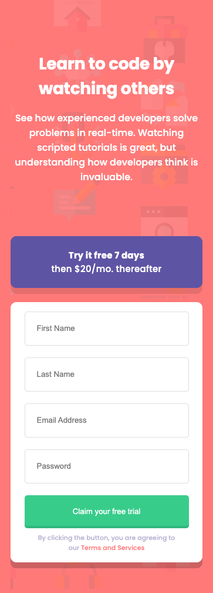
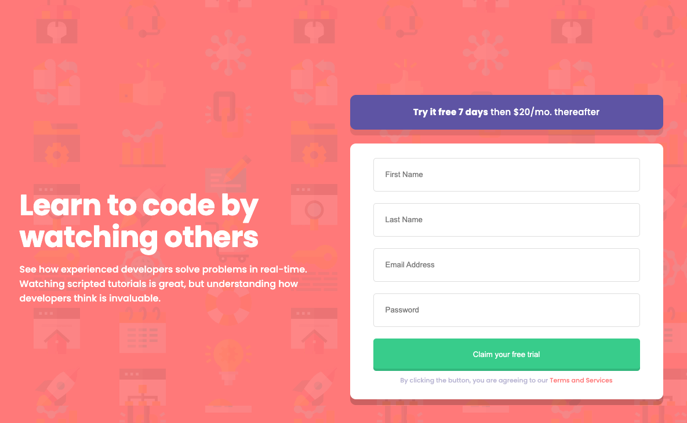

# Frontend Mentor - Intro component with sign up form

## Table of contents

- [Overview](#overview)
  - [Screenshot](#screenshot)
- [My process](#my-process)
  - [Built with](#built-with)
  - [What I learned](#what-i-learned)

## Overview

### Solution Screenshots

#### Mobile View

#### Desktop View

## My process

### Built with

- Semantic HTML5 markup
- Flexbox
- Mobile-first workflow

## My Solution Link
View Site: [intro component with sign-up form](https://vcollins1.github.io/signup-form/)